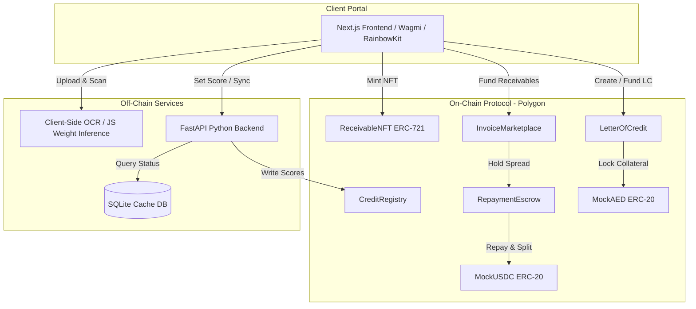
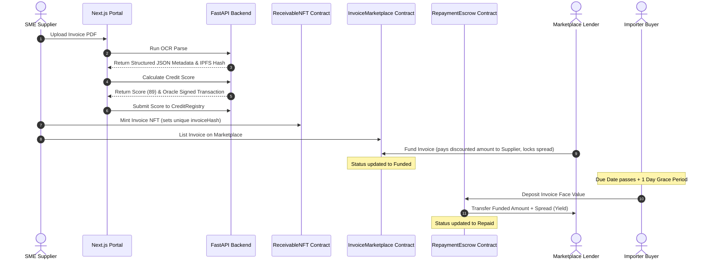

# Technical Architecture & System Design
**Platform Name**: Nafithah (نافذة)  
**Target Ledger**: Polygon PoS / Amoy Testnet  
**Consensus Layer**: Ethereum Virtual Machine (EVM Cancun)  

---

## 🖥️ System Topology Overview

Nafithah is a hybrid Web3 platform combining on-chain financial escrows with off-chain document intelligence and credit risk scoring.

---

## 📜 Smart Contract Layer Specifications

The smart contract layer is split into five core modules built using **OpenZeppelin Solidity v5.0**:

### 1. `ReceivableNFT.sol` (ERC-721 Invoice Tokenization)
*   **Purpose**: Encapsulates unpaid trade receivables as tradeable, non-fungible tokens.
*   **Duplicate Protection**: Computes a deterministic SHA-256 hash when minting:
    $$\text{invoiceHash} = \text{sha256}(\text{supplier} + \text{buyerAddress} + \text{invoiceNumber} + \text{amount} + \text{dueDate})$$
    Reverts with a custom `DuplicateInvoice()` error if the hash has already been registered, preventing double-factoring fraud.
*   **State Machine Management**: Controls invoice status transitions via an authorized `CONTROLLER_ROLE` (restricted to the Marketplace and Repayment Escrow).

### 2. `CreditRegistry.sol` (Dynamic Credit Score Registry)
*   **Purpose**: Stores and serves SME credit profiles (scores ranging from 0 to 100).
*   **Access Control**: Implements `onlyOracle` write permissions to protect scores from unauthorized updates.
*   **On-Chain Penalty Engine**: Applies credit score defaults (`-20 points` deduction, floor at 0) and increments the address's default counter.

### 3. `InvoiceMarketplace.sol` (Factoring & Discount Yield Engine)
*   **Purpose**: Matches SME invoice sellers with lenders.
*   **Dynamic Discount Rates**: Computes discount basis points (bps) based on the supplier's credit score:
    $$\text{discountBps} = \max(\text{MIN\_DISCOUNT\_BPS}, \text{BASE\_DISCOUNT\_BPS} - \text{score} \times \text{BPS\_PER\_POINT})$$
    *Base*: 15% (1500 bps), *Min*: 5% (500 bps). A score of 100 yields a 5% discount; a score of 0 yields a 15% discount.
*   **Grace Period Controller**: Reverts with `GracePeriodActive()` if a default is triggered before `dueDate + 1 day`, protecting SMEs from minor payment network delays.

### 4. `RepaymentEscrow.sol` (Settlement Split Escrow)
*   **Purpose**: Manages invoice repayments and capital routing.
*   **Capital Split**: Pulls the full face value from the buyer, pays the lender their funded amount plus the discount spread, and instructs the marketplace to release the yield.

### 5. `LetterOfCredit.sol` (Dirham Stablecoin Trade Escrow)
*   **Purpose**: Manages cross-border trade guarantees settled in mock UAE Dirham stablecoins (`mAED`).
*   **Shipment Proof Validation**: Exporters must submit a valid Bill of Lading document hash. Empty strings revert with `InvalidShipmentProof()`.
*   **Performance Default Triggers**:
    *   *Importer fails to fund*: Importer's credit score is penalized.
    *   *Exporter fails to ship*: Exporter is penalized and importer's stablecoin collateral is refunded.
    *   *Importer fails to release funds after shipment*: Importer is penalized and escrowed stablecoins are released to the exporter.

---

## 🤖 Off-Chain Services Layer

### 1. FastAPI OCR Extraction Pipeline
*   Accepts PDF or cargo image uploads.
*   Runs document parsing to extract structured JSON metadata (supplier, buyer, invoice amount, maturity).
*   Returns the data block and IPFS content hash to the client portal.

### 2. ML Credit Scoring Engine
*   Executes predictions based on SME transaction features.
*   *Scoring Model*: Logistic regression model trained on 1,000 synthetic SME profiles using:
    *   Payment history length (months)
    *   On-time payment percentage (%)
    *   Average invoice size
    *   Wallet age (days)
    *   On-chain transaction count
*   *Oracle Broadcast*: Signs the score transaction using the oracle private key to write it to `CreditRegistry.sol`.

---

## 🔄 Interaction Flow (Factoring Lifecycle)

