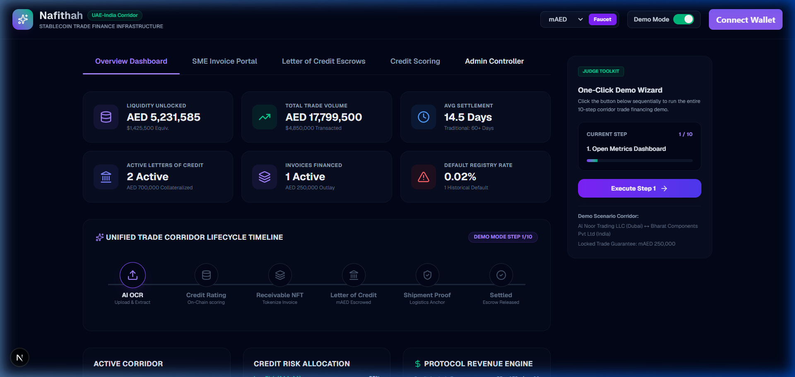
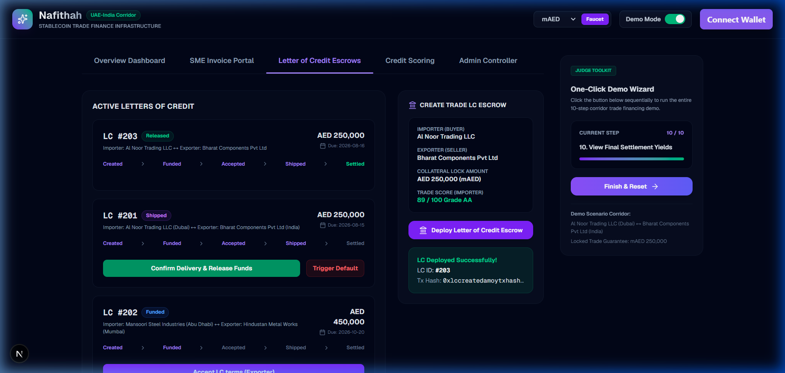
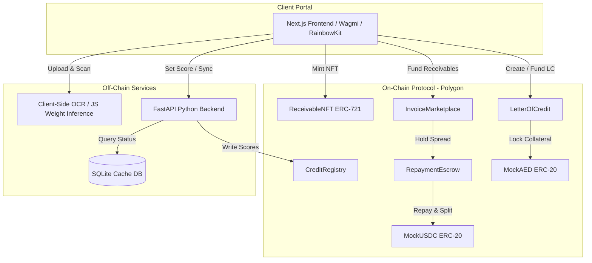

# Nafithah (نافذة) — Programmable Trade Finance Infrastructure
### Tokenizing trade receivables, automating Letters of Credit escrows, and preventing double-factoring fraud natively on Polygon for the UAE-India CEPA corridor.

[](https://opensource.org/licenses/MIT)
[](https://polygon.technology/)
[](https://soliditylang.org/)
[](https://nextjs.org/)
[](https://fastapi.tiangolo.com/)

---

## ⚡ 60-Second Overview for Judges & Investors

Nafithah is a programmable smart-commerce settlement layer built to eliminate the **$100B+ annual credit and fraud gaps** in cross-border SME trade finance.



### 🎯 Key Navigation Hubs
*   🖥️ **[Interactive Demo Wizard](http://localhost:3000)** (Launch application dashboard locally)
*   📐 **[System Architecture Guide](ARCHITECTURE.md)** (Deep-dive into smart contract code structures and ML models)
*   📜 **[Developer Integration Guide](DEVELOPER_GUIDE.md)** (Technical specifications and API contract interfaces)
*   📜 **[Solidity Smart Contracts](contracts/contracts/)** (Hardhat suite featuring 20 passing integration tests)
*   🐍 **[FastAPI Machine Learning Service](backend/)** (Off-chain OCR parsing and credit scoring engine)

---

## 💡 The Executive Summary

*   **The Problem**: SMEs face 60+ day payment delays, high bank factoring fees, and lenders lose billions to **double-factoring** (fraudsters listing the same invoice to multiple banks).
*   **The Solution**: Nafithah tokenizes invoice receivables as ERC-721 NFTs, runs off-chain machine learning to score trade risk, and deploys smart Letter of Credit escrows in native stablecoins.
*   **Why Polygon**: Low transaction gas, fast block confirmation times, and robust Solidity tooling allow processing micro-invoices profitably on-chain.
*   **Why UAE (Regional Depth)**: Tailored for the **UAE-India CEPA trade agreement**. Settle transactions instantly using mock Dirham stablecoins (`mAED`), aligned with the Central Bank of the UAE’s Payment Token Services framework and backed by hybrid DIFC court dispute resolution.

---

## 🚀 10-Step Demo Stepper Lifecycle

Experience the complete trade corridor transaction lifecycle in under 3 minutes via the **One-Click Demo Wizard** on the dashboard:

```
[1] Overview Dashboard → [2] Exporter Uploads PDF → [3] AI OCR Structures JSON → [4] ML Credit Score Generated (89) → [5] Mint Receivable NFT → [6] Deploy LC Escrow → [7] Importer Locks mAED Stablecoin → [8] Upload shipment proof (BoL) → [9] Confirm delivery & Release funds → [10] Repay Escrow & Distribute Payout
```



---

## 🔧 Technical Architecture Diagram



---

## ✨ Features Built for Smart Commerce

*   **Duplicate Invoice Rejection**: Prevents double-factoring fraud by hashing supplier, buyer, invoice number, amount, and due date parameters. If duplicate hashes exist on-chain, the contract reverts.
*   **Dynamic Factoring Discounting**: High credit scores (above 85) written to `CreditRegistry.sol` automatically lower the factoring discount spread (down to a floor rate of 5% APR).
*   **1-Day Default Grace Period**: Built-in cooling periods prevent default penalties from triggering before `dueDate + 1 day`, protecting SMEs from minor payment network delays.
*   **Dirham Stablecoin Settlement**: Multi-party Letter of Credit trade escrows are locked natively in Dirham stablecoins (`mAED`), eliminating cross-currency conversion friction.

---

## ⚙️ Installation & Test Guide

### 1. Test Contracts (20 passing unit tests)
```bash
cd contracts
npm install --legacy-peer-deps
$env:Path = "C:\Program Files\nodejs;" + $env:Path; npx.cmd hardhat test
```

### 2. Run Python Backend
```bash
cd backend
pip install fastapi uvicorn python-multipart web3 pypdf
python database.py
uvicorn main:app --reload --port 8000
```

### 3. Run React Frontend
```bash
cd frontend
npm install --legacy-peer-deps
npm run dev
```
Open `http://localhost:3000` to interact with the dashboard.
